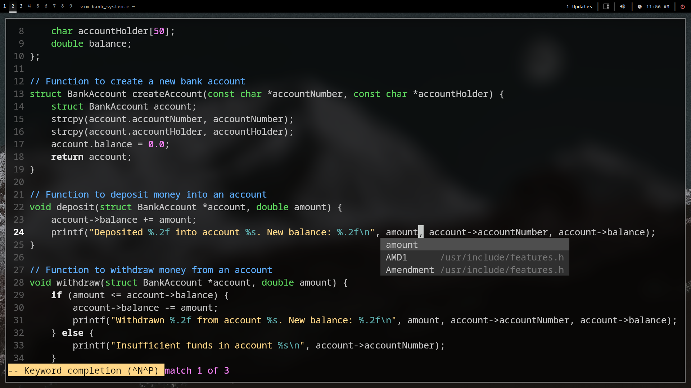

# Vim dotfiles



## ⚡️ Requirements

- [Vim](https://neovim.io/)
- [Git](https://git-scm.com/)
- A terminal that support true color and _undercurl_:
  - [Kitty](https://github.com/kovidgoyal/kitty) ***(Linux & Macos)***
  - [Wezterm](https://github.com/wez/wezterm) ***(Linux, Macos & Windows)***
  - [Alacritty](https://github.com/alacritty/alacritty) ***(Linux, Macos & Windows)***
  - [Iterm2](https://iterm2.com/) ***(Macos)***

## 🛠 Instalation

- #### Make a backup of your current vim files

`mv ~/.vimrc{,.bak}`

- #### Clone the repo

```
git clone https://github.com/PacosMosis/vim
cd vim
mv .vimrc /$HOME
```

- #### Remove the `.git` folder 

`rm -rf ~/vim/.git`

- #### Start Vim!

`vim`

## 📂 File Structure
```
~/$HOME
└── .vimrc
```

## 💡 Tip

It is recommended to run `:so %` after installation
